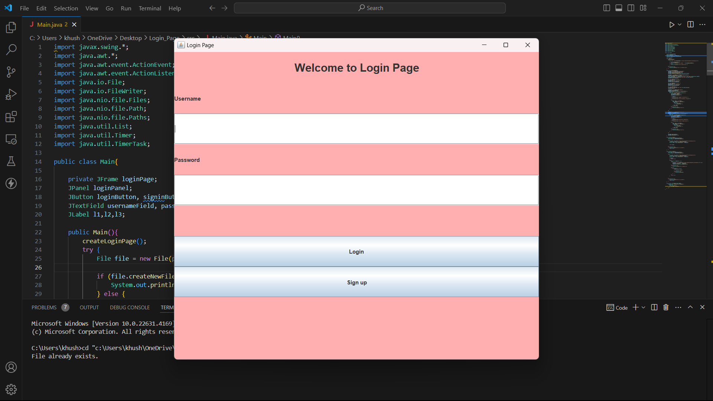

# Responsive-Login-Page
This project is a responsive login and registration page developed using Core and Advanced Java concepts. The application allows users to sign up and log in, with the user data stored securely in a database.
The project was built as part of my 4-week Core and Advanced Java course with Board Infinity.

Features
User Sign Up: New users can create an account by providing their credentials.
User Login: Registered users can log in using their username and password.
Database Integration: User data (e.g., username, password) is stored in a file using JDBC.
Responsive Design: The front end is responsive, meaning it adapts to different screen sizes.
Session Management: Implemented basic session management to maintain user sessions after login.

Technologies Used
Java Core: Basic Java concepts for handling logic.
Java Swing: Used for creating the front-end (GUI).
JDBC (Java Database Connectivity): To connect and interact with the database.
Servlets: These are used to manage HTTP requests and handle user authentication.

Setup and Installation
Prerequisites
Java JDK 8 or higher
Apache Tomcat Server (for Servlets)
Any IDE with Java support (e.g., IntelliJ IDEA, Eclipse)

Acknowledgments
This project was completed as part of the 4-week Core and Advanced Java course provided by Board Infinity.

Screenshot

